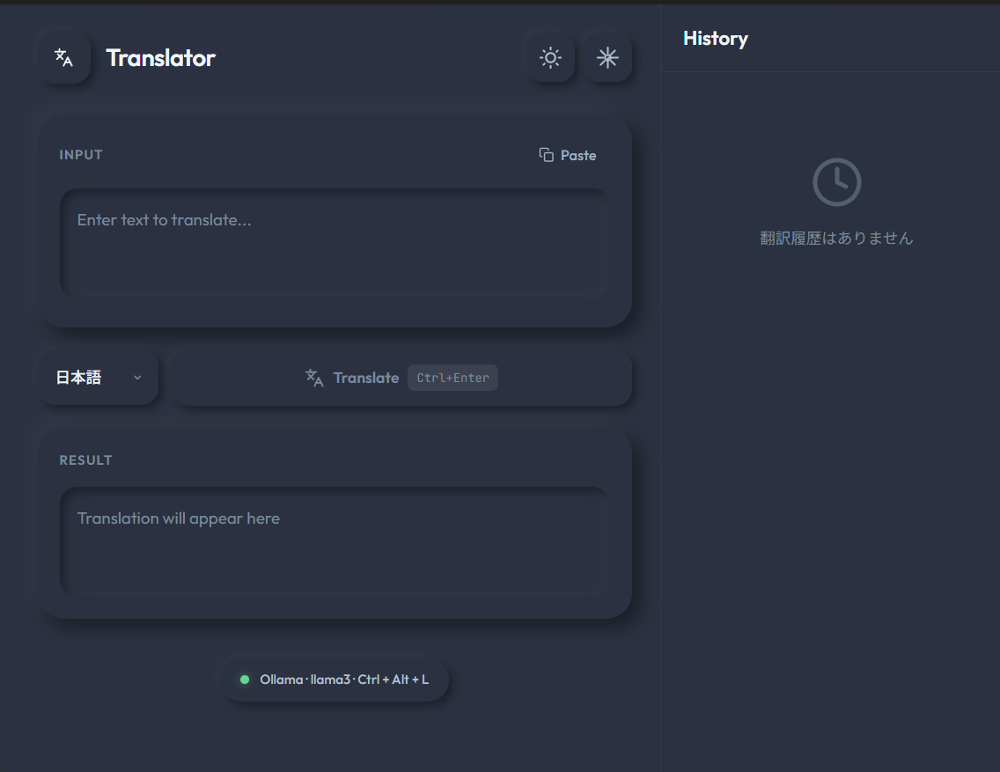

# Local Translator

<p align="center">
  
</p>

ローカルLLMサーバー（Ollama / LM Studio）を利用したプライバシー重視のデスクトップ翻訳アプリです。インターネット接続不要で、すべての翻訳処理がローカル環境で完結します。

## 特徴

- **完全ローカル処理** - 翻訳データが外部サーバーに送信されることはありません
- **原文の解説機能** - 単語・スラング・文脈の詳細解説をリアルタイム生成
- **翻訳履歴** - 最大50件の翻訳を自動保存、過去の翻訳をすぐに呼び出し可能
- **グローバルホットキー** - どのアプリからでもテキストを選択してショートカットキーで即座に翻訳
- **複数のLLMプロバイダー対応** - Ollama、LM Studioに対応
- **7言語対応** - 日本語、English、中文、한국어、Français、Deutsch、Español
- **システムトレイ常駐** - バックグラウンドで待機し、いつでも呼び出し可能
- **PC起動時の自動起動** - 設定で有効化可能
- **ダークモード対応** - ライト/ダークテーマを切り替え可能
- **ニューモーフィックUI** - モダンで美しいデザイン

## 動作要件

### 必須
- **OS**: Windows 10/11 または macOS 12+
- [Ollama](https://ollama.ai/) または [LM Studio](https://lmstudio.ai/) がインストール・起動済み
- 翻訳用のLLMモデル（例: `llama3`, `gemma2` など）

### macOSでの注意事項
- Universal Binary対応（Intel / Apple Silicon 両対応）
- 未署名アプリのため、初回起動時は右クリック → 「開く」 → 「開く」で起動してください

### 開発環境
- Node.js 18+
- Rust 1.70+
- npm または pnpm

## インストール

### リリースビルドを使用する場合

[Releases](../../releases) ページから最新の `.msi` または `.exe` をダウンロードしてインストールしてください。

### ソースからビルドする場合

```bash
# リポジトリをクローン
git clone https://github.com/your-username/local-translator.git
cd local-translator

# 依存関係をインストール
npm install

# 開発モードで起動
npm run tauri dev

# プロダクションビルド
npm run tauri build
```

ビルド成果物は `src-tauri/target/release/bundle/` に出力されます。

## 使い方

### 基本的な使い方

1. Ollama または LM Studio を起動し、翻訳用モデルをロード
2. Local Translator を起動
3. 翻訳したいテキストを入力欄にペースト、または直接入力
4. 翻訳先言語を選択して「Translate」ボタンをクリック

### グローバルホットキーで翻訳

1. 任意のアプリケーションでテキストを選択
2. ショートカットキー（デフォルト: `Ctrl+Alt+L`）を押す
3. 選択テキストが自動的にコピーされ、翻訳ウィンドウが表示
4. 翻訳結果が自動で表示される

### 原文の解説機能

翻訳結果の下部にある「原文の解説」ボタンをクリックすると、原文に含まれる単語・スラング・文脈について詳しい解説が生成されます。

- 難しい単語や専門用語の意味を確認できます
- スラングや口語表現のニュアンスを理解できます
- 文脈に応じた使い分けのポイントを学べます

### 翻訳履歴

- 過去の翻訳を最大50件まで自動保存
- 履歴アイコンをクリックして履歴サイドバーを表示
- 履歴項目をクリックすると、その翻訳を再表示
- 個別削除または一括クリアが可能
- 相対時刻表示（例: 「5分前」「1時間前」）

### システムトレイ

- **左クリック**: ウィンドウの表示/非表示を切り替え
- **右クリック**: メニューを表示（表示/隠す/終了）
- ウィンドウを閉じてもアプリは終了せず、トレイに格納されます

## 設定

Settings画面（歯車アイコン）から以下の設定が可能です：

| 項目 | 説明 |
|------|------|
| AI Provider | Ollama または LM Studio を選択 |
| Endpoint | LLMサーバーのURL（デフォルト: Ollama=`http://localhost:11434`, LM Studio=`http://localhost:1234`） |
| Model | 使用するモデル名 |
| Default Target Language | デフォルトの翻訳先言語 |
| Startup | PC起動時の自動起動ON/OFF |
| Hotkey | グローバルショートカットキーのカスタマイズ |

## 技術スタック

- **フロントエンド**: React 19 + TypeScript + Vite
- **バックエンド**: Tauri v2 (Rust)
- **スタイリング**: CSS (Neumorphic Design) + Tailwind CSS
- **LLM連携**: reqwest (HTTP client)

### 使用しているTauriプラグイン

- `tauri-plugin-clipboard-manager` - クリップボード操作
- `tauri-plugin-global-shortcut` - グローバルホットキー
- `tauri-plugin-autostart` - 自動起動
- `tauri-plugin-single-instance` - 多重起動防止
- `tauri-plugin-opener` - 外部リンクを開く

## 開発

```bash
# フロントエンドのみ起動（Vite dev server）
npm run dev

# Tauriアプリとして起動（フロントエンド + Rustバックエンド）
npm run tauri dev

# ビルド
npm run tauri build

# アイコン生成（SVGから全サイズのPNG/ICOを生成）
node scripts/generate-icons.mjs
```

### アイコンのカスタマイズ

アプリアイコンを変更する場合は `src-tauri/icons/icon.svg` を編集し、上記コマンドで再生成してください。
